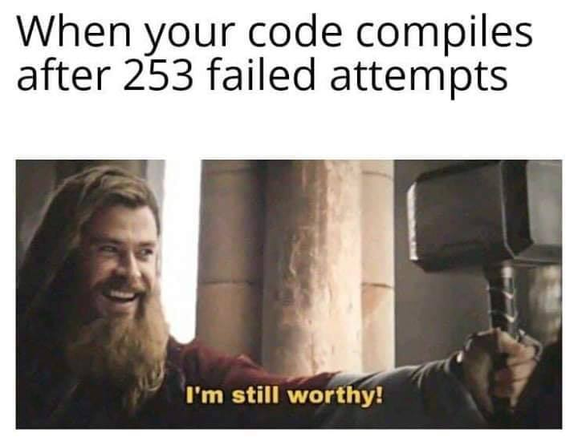
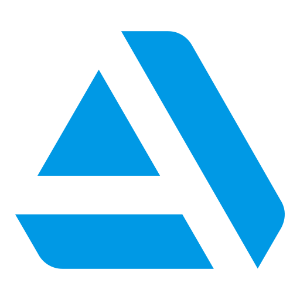
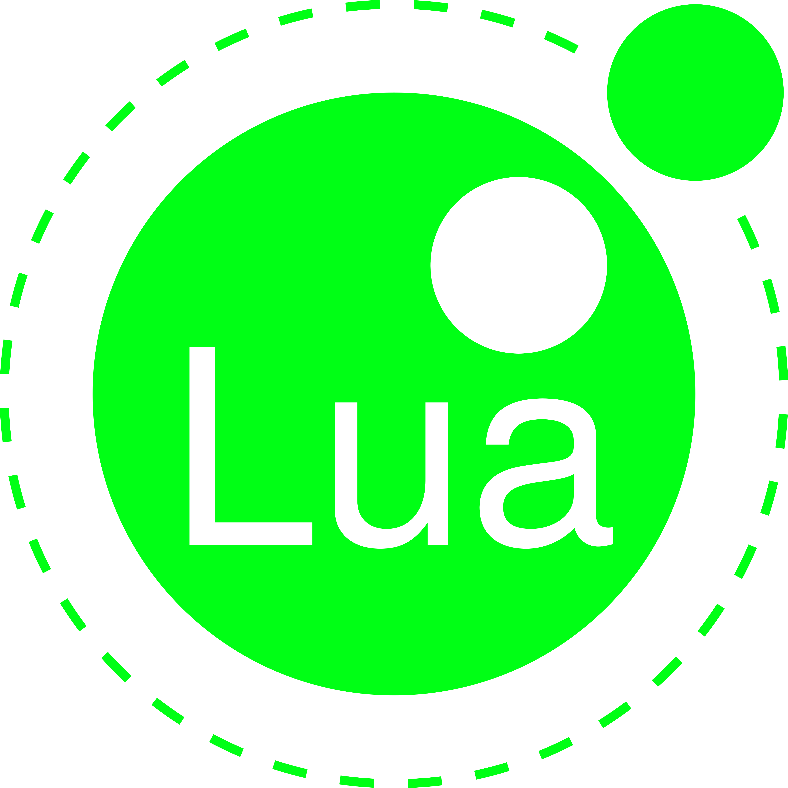
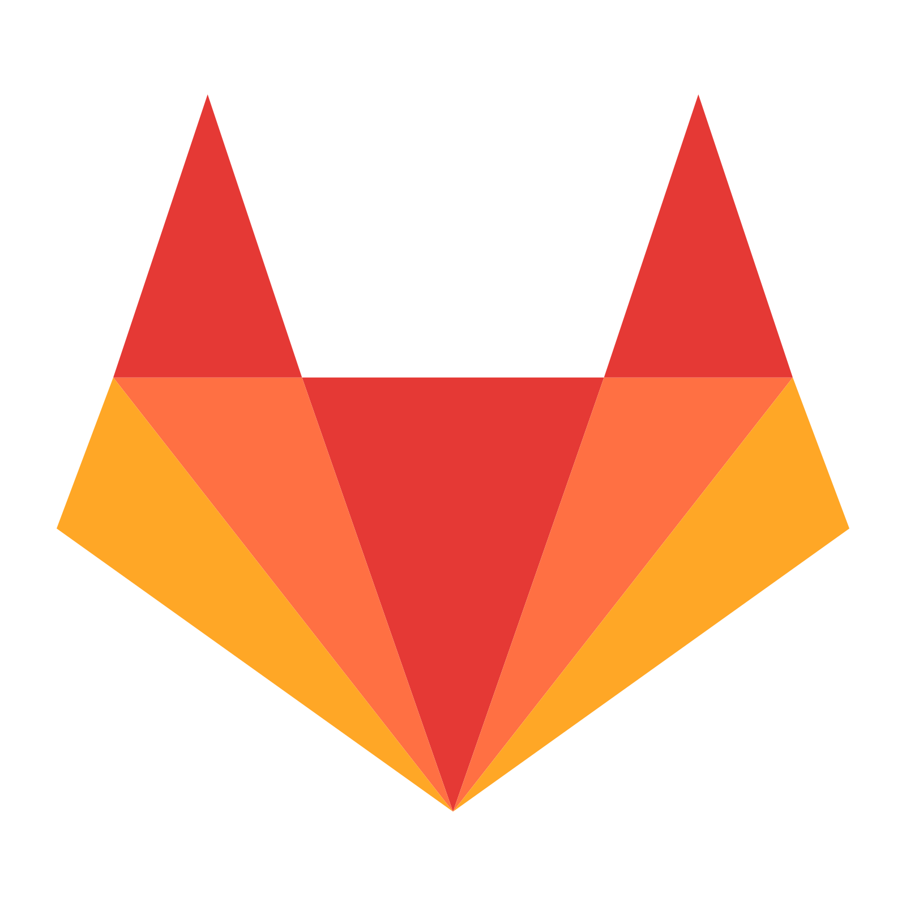

<table>
  <tr>
    <td></td>
    <td>
      <h1>
      

        Hello, I am Can Karka
        
      

      </h1>
        

          
        

      

      &nbsp;&nbsp;&nbsp;&nbsp;
      &nbsp;&nbsp;&nbsp;&nbsp;
      &nbsp;&nbsp;&nbsp;&nbsp;
      

    </td>
  </tr>
</table>

## Featured Projects

<table>
  <tr>
    <td>
      

        
      

    </td>
    <td>
      

        
      

    </td>
  </tr>
  <tr>
    <td>
      

        
      

    </td>
    <td>
      

        
      

    </td>
  </tr>
</table>

## I am currently working on

## Skills

<table>
  <tr>
    <td>
      

      <table>
        <tr>
          <th>
Programs
</th>
          <td>
            &nbsp;&nbsp;&nbsp;&nbsp;
            &nbsp;&nbsp;&nbsp;&nbsp;
            &nbsp;&nbsp;&nbsp;&nbsp;
            &nbsp;&nbsp;&nbsp;&nbsp;
            &nbsp;&nbsp;&nbsp;&nbsp;
            &nbsp;&nbsp;&nbsp;&nbsp;
            &nbsp;&nbsp;&nbsp;&nbsp;
            &nbsp;&nbsp;&nbsp;&nbsp;
            &nbsp;&nbsp;&nbsp;&nbsp;
            &nbsp;&nbsp;&nbsp;&nbsp;
            &nbsp;&nbsp;&nbsp;&nbsp;
            &nbsp;&nbsp;&nbsp;&nbsp;
          </td>
        </tr>
        <tr>
          <th>
Languages
</th>
          <td>
            &nbsp;&nbsp;&nbsp;&nbsp;
            &nbsp;&nbsp;&nbsp;&nbsp;
            &nbsp;&nbsp;&nbsp;&nbsp;
            &nbsp;&nbsp;&nbsp;&nbsp;
            &nbsp;&nbsp;&nbsp;&nbsp;
          </td>
        </tr>
        <tr>
          <th>
APIs
</th>
          <td>
            &nbsp;&nbsp;&nbsp;&nbsp;
            &nbsp;&nbsp;&nbsp;&nbsp;
          </td>
        </tr>
        <tr>
          <th>
Utilities
</th>
          <td>
            &nbsp;&nbsp;&nbsp;&nbsp;
            &nbsp;&nbsp;&nbsp;&nbsp;
            &nbsp;&nbsp;&nbsp;&nbsp;
          </td>
        </tr>
      </table>
      

    </td>
    <td>
       
      

        
      

    </td>
  </tr>
</table>

## My tech stack

## Stats

